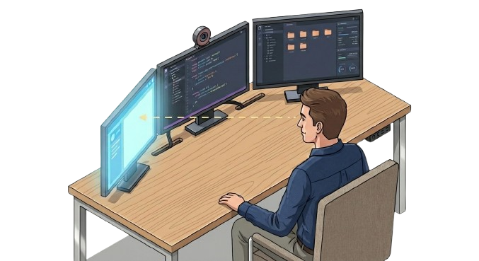

<p align="center">

```
 ██████╗  █████╗ ███████╗███████╗ ██████╗████████╗██╗
██╔════╝ ██╔══██╗╚══███╔╝██╔════╝██╔════╝╚══██╔══╝██║
██║  ███╗███████║  ███╔╝ █████╗  ██║        ██║   ██║
██║   ██║██╔══██║ ███╔╝  ██╔══╝  ██║        ██║   ██║
╚██████╔╝██║  ██║███████╗███████╗╚██████╗   ██║   ███████╗
 ╚═════╝ ╚═╝  ╚═╝╚══════╝╚══════╝ ╚═════╝   ╚═╝   ╚══════╝
```

**Head tracking display switcher for macOS**



</p>

---

gazectl uses your webcam to detect which monitor you're looking at and automatically switches focus to it. It uses Apple's Vision framework for real-time face tracking and works with the [Aerospace](https://github.com/nikitabobko/AerospaceWM) tiling window manager.

> macOS only. Requires macOS 14+ and [Aerospace](https://github.com/nikitabobko/AerospaceWM).

## Install

```bash
npx gazectl
```

Or install globally:

```bash
npm i -g gazectl
```

## Usage

```bash
# First run — calibrates automatically
gazectl

# Force recalibration
gazectl --calibrate

# With verbose logging
gazectl --verbose
```

On first run, gazectl asks you to look at each monitor and press Enter. It samples your head angle for 2 seconds per monitor, then saves calibration to `~/.local/share/gazectl/calibration.json`.

## Options

| Flag | Default | Description |
|------|---------|-------------|
| `--calibrate` | off | Force recalibration |
| `--calibration-file` | `~/.local/share/gazectl/calibration.json` | Custom calibration path |
| `--camera` | 0 | Camera index |
| `--verbose` | off | Print yaw angle continuously |

## How it works

1. **Calibrate** — look at each monitor, gazectl records the yaw angle
2. **Track** — Apple Vision detects head yaw in real-time (~30fps)
3. **Switch** — when yaw crosses the midpoint between calibrated angles, fires `aerospace focus-monitor`

## Build from source

```bash
swift build -c release
cp .build/release/gazectl /usr/local/bin/gazectl
```

## License

MIT
